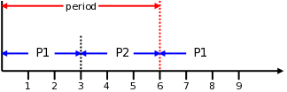
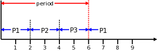
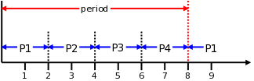

# 改善调度器延迟

> 原文链接 [Improving scheduler latency](https://lwn.net/Articles/404993/)，by Jonathan Corbet，2010-9-14

人们对内核 CPU 调度程序的交互式响应能力有无休止的讨论。看起来，这一问题的解决方案永远无法让所有人满意。但是，最近有关该主题的一些讨论表明，这些年来众多的讨论成果都有作用，这些讨论将我们的注意力逐渐转移到正确位置。

CFS 调度程序将时间划分为多个时间周期，每个进程在周期内只运行一次。因此，周期的长度确定了最大延迟，即进程可以期望的最长运行前等待时间。该时间长度默认为 6ms。如果有两个进程正在运行，则这 6ms 将被划分为以下形式：

假定这两个进程是完全 CPU 受限（CPU-bound）的，具有相同的优先级，并且没有其他干扰情况。如果加入第三个理想的 CPU 受限进程，则调度周期会为每个进程分为更小的片段：

但是，调度周期无法被划分为无限小的片段。由于每次进行进程上下文切换都会有系统开销和缓存影响，频繁的进程切换将对系统的总吞吐量产生可观的影响。默认情况下，当前的调度器给每个进程设置了 2ms 的最短执行时间；如果进程数量比较多，6ms 周期下的进程平均执行时间按上述划分将小于 2ms，调度器将会选择延长调度周期。因此，如果在上面的例子中再添加一个理想的进程，结果将是：

换句话说，一旦负载足够高，内核将开始牺牲响应延迟以保证高吞吐量。在负载非常高的情况下（例如经常提到的多进程构建 Linux 内核），延迟可能会达到让用户感到烦躁的地步。 Mathieu Desnoyers 开发了这个[补丁](https://lwn.net/Articles/404575/)来改善高负载系统的延迟，当有八个以上的进程正在运行时，缩小每个进程的最短运行时间。

Mathieu 的补丁包含了一些测试结果，这些结果表明最大延迟大约减少了一半。即便如此，Peter Zijlstra 还是[拒绝了补丁](https://lwn.net/Articles/405017/)，并说：“**毫无吸引力，看起来像是没有概念完整性的随机更改。**” 然而，Linus 只进行了[温和的指责](https://lwn.net/Articles/405018/)，他觉得当前内核的延迟性能确实不尽人意。此后一段时间的讨论，得出了一个有趣的结论：每个人都是部分正确的。

Mathieu 的补丁没有达到预期的效果，因为他对调度周期计算方式的理解略有偏差。所以，调度程序维护人员拒绝该补丁是正确。但是，该补丁确实提高了延迟性能。事实证明，补丁中真正重要的变化是将最小时间片长度从 2ms 减少到 750µs。这样，调度器可以在最多有八个进程时保持调度周期不变，并减少多于八个进程后的调度周期延长。这带来了更好的延迟性能，和看起来更好的交互体验。仅更改最小时间片的[补丁](https://lwn.net/Articles/405025/)已快速进入主线，并随着 2.6.36-rc5 版本发布。有趣的是，尽管担心较短的时间片会影响吞吐量，但到目前为止，尚未对该补丁进行大量的吞吐量基准测试。

但是，事情还不止于此。Mathieu 的一项测试在使用 timer_create 函数时设置了 SIGEV_THREAD 标志，从而为每个事件创建一个新线程。看起来，这个新线程需要很长时间才能得到 CPU 运行。问题根源似乎在于试图平衡新派生进程（newly forked process）与其父进程之间的 CPU 使用的代码，而在过去，这个地方常常被证明是有问题的。Mike Galbraith [指出](https://lwn.net/Articles/405029/)，调度程序的 START_DEBIT 功能将新进程的首次执行推迟到下一个调度周期，影响了延迟性能。禁用该功能可以显着改善延迟性能，但会在其他地方带来开销。特别是，子进程派生非常多的负载（fork-heavy loads）会对其他进程照成不利的影响，大量派生的子进程会抢先占用大量 CPU 时间。

Mathieu 发布了一个[补丁](https://lwn.net/Articles/405046/)，新增了一项名为 START_NICE 的功能。如果启用它，fork 后父子进程的优先级将降低，且只维持一个调度周期。这种惩罚，可使父子进程都在当前调度周期得到执行；并且相对于关闭 START_DEBIT，这种惩罚对系统中其余进程的影响更小。相关的基准测试结果显示此更改带来了显着改善。

与此同时，Peter 从社区消失了一段时间，并带着一个[更复杂的补丁](https://lwn.net/Articles/405033/)归来，这个补丁采用了另一种方法：新进程仍会放在队列的末尾，以确保现有进程的当前时间片内不会被新进程抢占。但是，如果启用了新的 DEADLINE 功能，则在未来的一个调度周期内，每个新进程还会设置一个截止时间。如果一个进程在截止时间到达时还没有运行过，它将立即开始运行。这应该会限制新线程的最大延迟。

但是，此补丁很大很复杂，Peter 警告说，他只会在代码并入主线之前进行测试。所以这个补丁应该不会出现在 2.6.36 版本中；但是，如果它成功通过了基准测试，可能会在下一个版本中并入主线。
